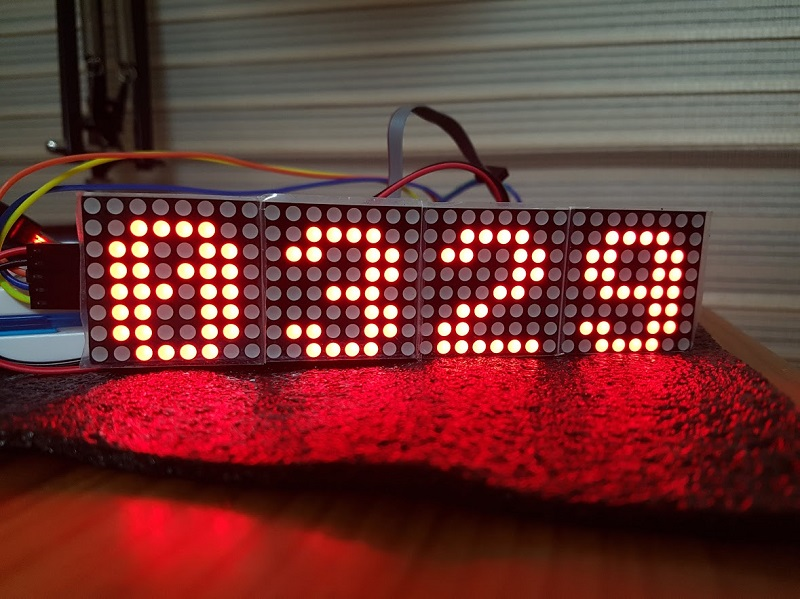
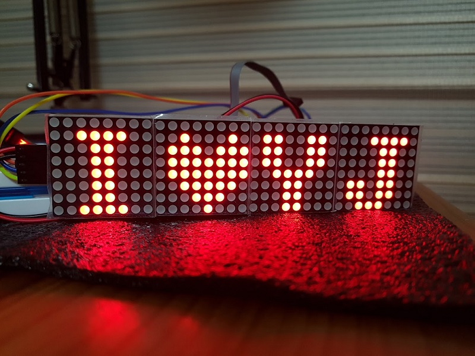

# AVR_MAX7219_MATRIX

MAX7219 Library for AVR + Example code

ATmega328p MCU was used for testing. 
You may need to modify SPI features to use this libary for other AVR MCUs.

Description(Korean) 
https://blog.naver.com/eziya76/221237941411

Reference 
Font : https://xantorohara.github.io/led-matrix-editor/

 
 
